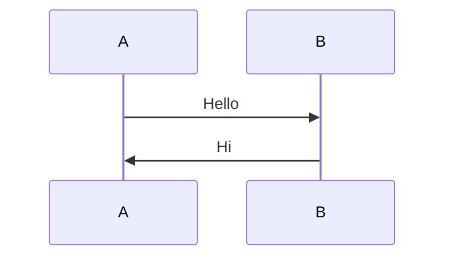

# Mermaid可视化工具推荐

**文档版本**: v1.0  
**最后更新**: 2025-11-18

本文档推荐一些可以可视化Mermaid语法的工具，方便查看和编辑时序图、流程图等。

---

## 一、VS Code扩展（推荐⭐⭐⭐⭐⭐）

### 1.1 Markdown Preview Mermaid Support

**扩展名**: `bierner.markdown-mermaid`

**安装方式**:
1. 打开VS Code
2. 按 `Ctrl+Shift+X` (Windows/Linux) 或 `Cmd+Shift+X` (Mac) 打开扩展市场
3. 搜索 `Markdown Preview Mermaid Support`
4. 点击安装

**使用方法**:
- 打开包含Mermaid代码的Markdown文件
- 按 `Ctrl+Shift+V` (Windows/Linux) 或 `Cmd+Shift+V` (Mac) 预览
- Mermaid图表会自动渲染

**优点**:
- ✅ 完全免费
- ✅ 集成在VS Code中，无需切换工具
- ✅ 支持实时预览
- ✅ 支持导出为HTML/PDF

---

### 1.2 Mermaid Preview

**扩展名**: `vstirbu.vscode-mermaid-preview`

**安装方式**: 在VS Code扩展市场搜索 `Mermaid Preview`

**使用方法**:
- 打开 `.mmd` 或包含Mermaid代码的文件
- 右键选择 "Open Preview" 或使用命令面板

**优点**:
- ✅ 专门用于Mermaid预览
- ✅ 支持导出为PNG/SVG
- ✅ 支持交互式编辑

---

## 二、在线工具（推荐⭐⭐⭐⭐⭐）

### 2.1 Mermaid Live Editor

**网址**: https://mermaid.live/

**功能**:
- ✅ 实时编辑和预览
- ✅ 支持导出为PNG/SVG
- ✅ 支持分享链接
- ✅ 完全免费，无需注册

**使用方法**:
1. 访问 https://mermaid.live/
2. 左侧编辑Mermaid代码
3. 右侧实时预览
4. 点击 "Actions" 导出图片

**优点**:
- ✅ 最简单易用
- ✅ 无需安装
- ✅ 支持所有Mermaid语法

---

### 2.2 Mermaid.ink

**网址**: https://mermaid.ink/

**功能**:
- ✅ 将Mermaid代码转换为图片URL
- ✅ 支持PNG/SVG格式
- ✅ 可以嵌入到文档中

**使用方法**:
```markdown

```

**优点**:
- ✅ 适合嵌入到文档中
- ✅ 支持URL编码的Mermaid代码

---

### 2.3 GitHub / GitLab

**网址**: 
- GitHub: https://github.com
- GitLab: https://gitlab.com

**功能**:
- ✅ 原生支持Mermaid渲染
- ✅ 在README.md中直接显示
- ✅ 支持所有Mermaid图表类型

**使用方法**:
1. 将Markdown文件推送到GitHub/GitLab
2. 在README.md或Issue中使用Mermaid代码块
3. 自动渲染

**优点**:
- ✅ 完全免费
- ✅ 版本控制集成
- ✅ 团队协作友好

**示例**:
```markdown

```

---

## 三、浏览器扩展（推荐⭐⭐⭐⭐）

### 3.1 Markdown Viewer (Chrome)

**扩展名**: Markdown Viewer

**安装方式**:
1. 打开Chrome网上应用店
2. 搜索 "Markdown Viewer"
3. 安装扩展

**功能**:
- ✅ 在浏览器中预览Markdown文件
- ✅ 支持Mermaid渲染（需要配置）
- ✅ 支持本地文件

**配置Mermaid支持**:
- 在扩展设置中启用 "Mermaid support"

---

### 3.2 Markdown Preview Plus (Chrome)

**扩展名**: Markdown Preview Plus

**功能**:
- ✅ 预览Markdown文件
- ✅ 支持Mermaid语法
- ✅ 支持GitHub风格

---

## 四、桌面应用（推荐⭐⭐⭐）

### 4.1 Typora

**网址**: https://typora.io/

**功能**:
- ✅ 所见即所得Markdown编辑器
- ✅ 原生支持Mermaid渲染
- ✅ 支持导出为PDF/HTML/Word

**价格**: 
- 免费试用
- 正式版：$14.99（一次性购买）

**优点**:
- ✅ 界面美观
- ✅ 实时预览
- ✅ 支持多种导出格式

---

### 4.2 Obsidian

**网址**: https://obsidian.md/

**功能**:
- ✅ 知识管理工具
- ✅ 支持Mermaid图表
- ✅ 支持双向链接

**价格**: 
- 个人使用免费
- 商业使用需要付费

**优点**:
- ✅ 强大的笔记功能
- ✅ 支持插件扩展
- ✅ 本地存储

---

### 4.3 Mark Text

**网址**: https://marktext.app/

**功能**:
- ✅ 开源Markdown编辑器
- ✅ 支持Mermaid渲染
- ✅ 完全免费

**优点**:
- ✅ 完全免费开源
- ✅ 跨平台支持
- ✅ 实时预览

---

## 五、命令行工具（推荐⭐⭐⭐）

### 5.1 Mermaid CLI

**安装方式**:
```bash
npm install -g @mermaid-js/mermaid-cli
```

**使用方法**:
```bash
# 将Mermaid文件转换为PNG
mmdc -i input.mmd -o output.png

# 将Mermaid文件转换为SVG
mmdc -i input.mmd -o output.svg

# 从Markdown文件中提取Mermaid代码并转换
mmdc -i input.md -o output.png
```

**优点**:
- ✅ 适合自动化流程
- ✅ 支持批量转换
- ✅ 可以集成到CI/CD

---

## 六、推荐组合方案

### 6.1 开发环境（推荐⭐⭐⭐⭐⭐）

**方案**: VS Code + Markdown Preview Mermaid Support

**优点**:
- ✅ 开发时直接预览
- ✅ 无需切换工具
- ✅ 完全免费

**适用场景**:
- 编写文档时实时预览
- 调试Mermaid语法
- 团队协作开发

---

### 6.2 在线分享（推荐⭐⭐⭐⭐⭐）

**方案**: GitHub/GitLab + Mermaid Live Editor

**优点**:
- ✅ GitHub/GitLab原生支持
- ✅ Mermaid Live Editor用于快速测试
- ✅ 完全免费

**适用场景**:
- 文档托管在GitHub/GitLab
- 快速测试Mermaid语法
- 在线协作

---

### 6.3 专业文档编辑（推荐⭐⭐⭐⭐）

**方案**: Typora 或 Obsidian

**优点**:
- ✅ 专业的Markdown编辑器
- ✅ 美观的界面
- ✅ 支持多种导出格式

**适用场景**:
- 需要专业排版
- 需要导出为PDF/Word
- 个人知识管理

---

## 七、快速开始指南

### 7.1 VS Code用户（最简单）

1. **安装扩展**:
   ```
   Ctrl+Shift+X → 搜索 "Markdown Preview Mermaid Support" → 安装
   ```

2. **打开文件**:
   ```
   打开 DEV/支付流程时序图.md
   ```

3. **预览**:
   ```
   Ctrl+Shift+V (预览)
   ```

4. **查看Mermaid图表**:
   - 图表会自动渲染
   - 可以交互式查看

---

### 7.2 在线用户（无需安装）

1. **访问**: https://mermaid.live/

2. **复制Mermaid代码**:
   - 从 `DEV/支付流程时序图.md` 复制Mermaid代码块

3. **粘贴到编辑器**:
   - 左侧编辑区粘贴代码

4. **查看预览**:
   - 右侧自动显示渲染结果

5. **导出图片**:
   - 点击 "Actions" → "Download PNG" 或 "Download SVG"

---

### 7.3 GitHub用户

1. **创建仓库**:
   - 在GitHub创建新仓库

2. **上传文件**:
   - 上传 `DEV/支付流程时序图.md`

3. **查看渲染**:
   - 在GitHub上打开文件
   - Mermaid图表自动渲染

---

## 八、常见问题

### 8.1 VS Code预览不显示Mermaid

**解决方法**:
1. 确认已安装 "Markdown Preview Mermaid Support" 扩展
2. 重启VS Code
3. 检查Mermaid代码块语法是否正确：
   ```markdown
   ```mermaid
   sequenceDiagram
       A->>B: Hello
   ```
   ```

---

### 8.2 如何导出为图片

**方法1: Mermaid Live Editor**
- 访问 https://mermaid.live/
- 编辑代码
- 点击 "Actions" → "Download PNG/SVG"

**方法2: Mermaid CLI**
```bash
npm install -g @mermaid-js/mermaid-cli
mmdc -i input.mmd -o output.png
```

**方法3: VS Code扩展**
- 安装 "Mermaid Preview" 扩展
- 右键选择 "Export as PNG/SVG"

---

### 8.3 如何嵌入到文档中

**方法1: GitHub/GitLab**
- 直接在Markdown中使用Mermaid代码块
- 自动渲染

**方法2: 使用图片URL**
- 使用 Mermaid.ink 生成图片URL
- 嵌入到文档中

**方法3: 导出为图片**
- 使用工具导出为PNG/SVG
- 使用Markdown图片语法嵌入

---

## 九、总结

### 最佳推荐（按使用场景）

| 使用场景 | 推荐工具 | 理由 |
|---------|---------|------|
| **开发时预览** | VS Code + Markdown Preview Mermaid Support | 集成在开发环境中，实时预览 |
| **快速测试** | Mermaid Live Editor | 无需安装，在线使用 |
| **文档托管** | GitHub/GitLab | 原生支持，自动渲染 |
| **专业编辑** | Typora | 界面美观，功能强大 |
| **知识管理** | Obsidian | 强大的笔记功能 |
| **批量转换** | Mermaid CLI | 命令行工具，适合自动化 |

---

## 十、相关资源

- **Mermaid官方文档**: https://mermaid.js.org/
- **Mermaid语法指南**: https://mermaid.js.org/intro/
- **Mermaid示例**: https://mermaid.js.org/ecosystem/tutorials.html
- **VS Code扩展市场**: https://marketplace.visualstudio.com/

---

**提示**: 建议先尝试VS Code扩展或Mermaid Live Editor，这两个工具最简单易用。

