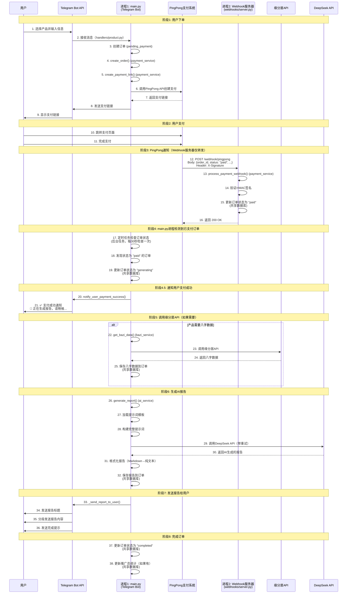
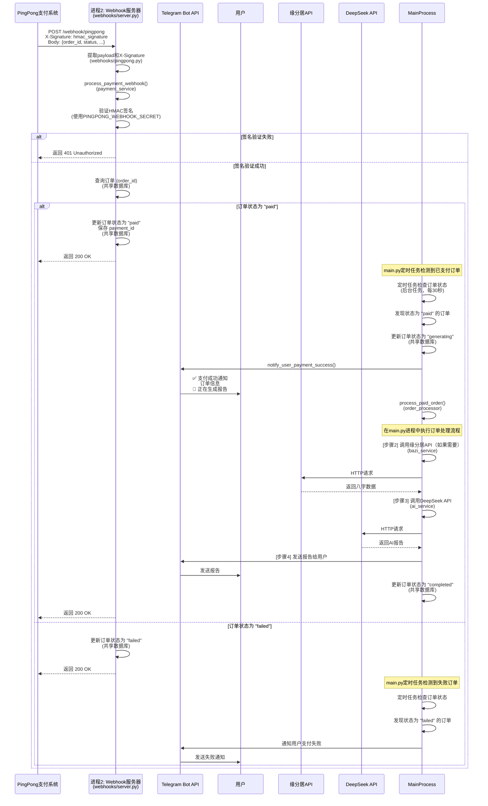
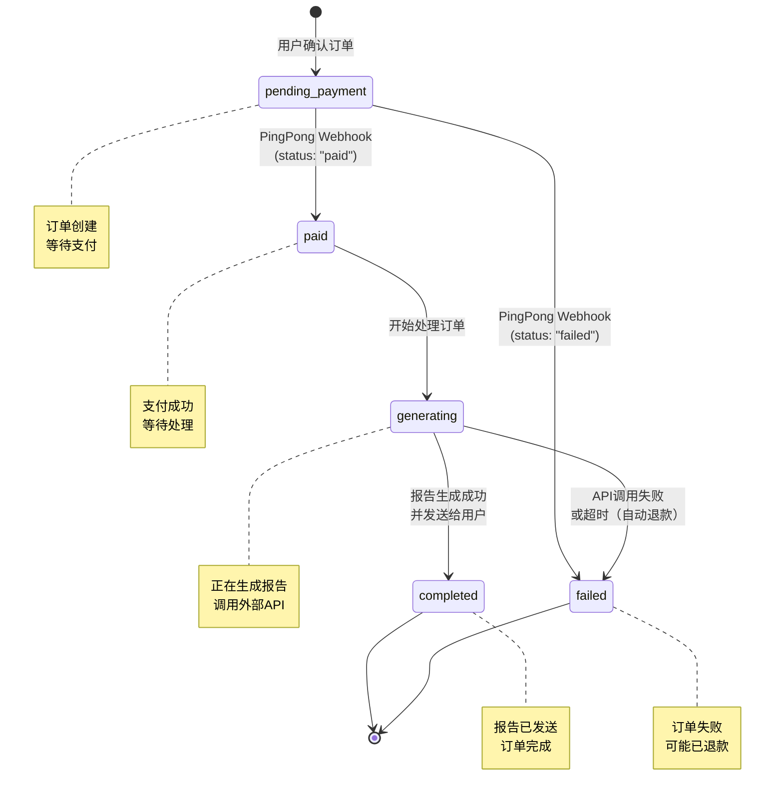
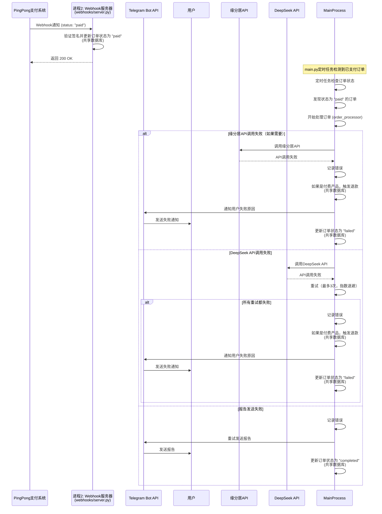

# 支付流程时序图（Mermaid格式）

本文档包含完整的支付流程时序图，使用Mermaid语法绘制。

## 颜色说明（按项目结构划分）

- 🟧 **橙色** (`#FFE5B4`): 用户（实际用户）
- 🟢 **绿色** (`#B4FFB4`): **进程1: main.py（Telegram Bot主进程）** - 包括：
  - Telegram Bot处理（handlers）
  - 支付服务（payment_service）
  - 订单处理（order_processor）
  - 缘分居服务调用（bazi_service）
  - DeepSeek服务调用（ai_service）
- 🔵 **蓝色** (`#B4E5FF`): **进程2: Webhook服务器（webhooks/server.py）** - 仅负责：
  - PingPong Webhook接收（webhooks/pingpong.py）
  - 支付签名验证（payment_service）
  - 更新订单状态为 "paid"（共享数据库）
  - **不处理业务逻辑**（不调用缘分居API、DeepSeek API等）
- 🔴 **红色** (`#FFB4B4`): PingPong支付系统（外部第三方服务）
- 🟦 **浅蓝色** (`#B4E5FF`): Telegram Bot API（Telegram官方服务器）
- 🟣 **紫色** (`#FFB4E5`): 缘分居API（外部第三方服务）
- 🟪 **深紫色** (`#E5B4FF`): DeepSeek API（外部第三方服务）

**注意**: 
- main.py和Webhook服务器是两个**独立的进程**
- **Webhook服务器仅作为PingPong支付结果的消息转发通道**，不处理业务逻辑
- **所有业务逻辑（调用缘分居API、DeepSeek API等）都在main.py进程中处理**
- 两个进程通过**共享数据库**协作：Webhook服务器更新订单状态为"paid"，main.py定时检查并处理

---

## 一、完整支付流程时序图



---

## 二、Webhook通知详细流程



---

## 三、订单状态流转图



---

## 四、关键时间点说明

### 4.1 用户下单阶段（同步）

- **时间**: 用户操作时间（几秒）
- **操作**: 选择产品 → 输入信息 → 确认订单
- **结果**: 订单创建，状态为 `pending_payment`
- **进程**: main.py（进程1）

### 4.2 用户支付阶段（用户操作）

- **时间**: 用户支付时间（几分钟）
- **操作**: 跳转PingPong → 完成支付
- **结果**: PingPong处理支付

### 4.3 PingPong通知阶段（异步）

- **时间**: 支付完成后立即（几秒）
- **操作**: PingPong发送Webhook → 验证签名 → 更新订单
- **结果**: 订单状态更新为 `paid`
- **进程**: Webhook服务器（进程2）

### 4.4 业务逻辑处理阶段（异步）

- **时间**: 几分钟（取决于API响应时间）
- **操作**: 
  - 调用缘分居API（如果需要，约5-10秒）
  - 调用DeepSeek API（约30-120秒，可能重试）
  - 发送报告给用户（几秒）
- **结果**: 订单状态更新为 `completed`
- **进程**: Webhook服务器（进程2）

---

## 五、关键配置

### 5.1 PingPong Webhook URL

```
开发环境（ngrok）:
https://xxxx-xx-xx-xx-xx.ngrok-free.app/webhook/pingpong

生产环境:
https://yourdomain.com/webhook/pingpong
```

### 5.2 支付链接中的notify_url

在创建支付链接时，`notify_url` 参数设置为：

```python
notify_url = f"{settings.WEBHOOK_URL}/webhook/pingpong"
```

这告诉PingPong在支付状态变更时，向这个URL发送Webhook通知。

---

## 六、错误处理流程



---

## 七、进程关系说明

### 7.1 两个独立进程

1. **进程1: main.py** - Telegram Bot主进程
   - 处理用户消息和命令
   - 生成支付链接
   - **处理所有业务逻辑**（调用缘分居API、DeepSeek API等）
   - **定时检查已支付订单并处理**（后台任务）
   - 运行模式：Polling（开发）或Webhook（生产）

2. **进程2: webhooks/server.py** - PingPong Webhook服务器
   - **仅作为PingPong支付结果的消息转发通道**
   - 接收PingPong支付回调
   - 验证签名
   - 更新订单状态为 "paid"（共享数据库）
   - **不处理业务逻辑**（不调用缘分居API、DeepSeek API等）

### 7.2 进程间通信

- **共享数据库**: 两个进程访问同一个数据库
  - Webhook服务器：更新订单状态为 "paid"
  - main.py：定时检查状态为 "paid" 的订单并处理
- **定时任务**: main.py中的后台任务定期检查已支付订单
- **共享代码**: 两个进程使用相同的业务逻辑代码（services），但业务逻辑只在main.py中执行

### 7.3 部署要求

- ✅ 两个进程都需要运行
- ✅ Webhook服务器需要HTTPS（PingPong要求）
- ✅ 可以部署在同一服务器或不同服务器
- ✅ main.py需要运行定时任务，定期检查并处理已支付订单

---

**提示**: 这些时序图可以在支持Mermaid的Markdown查看器中直接渲染（如GitHub、GitLab、VS Code等）。

**相关文档**: 
- [项目架构与进程关系说明](./项目架构与进程关系说明.md) - 详细的架构说明
- [支付流程与Webhook机制详解](./支付流程与Webhook机制详解.md) - 详细的流程说明
